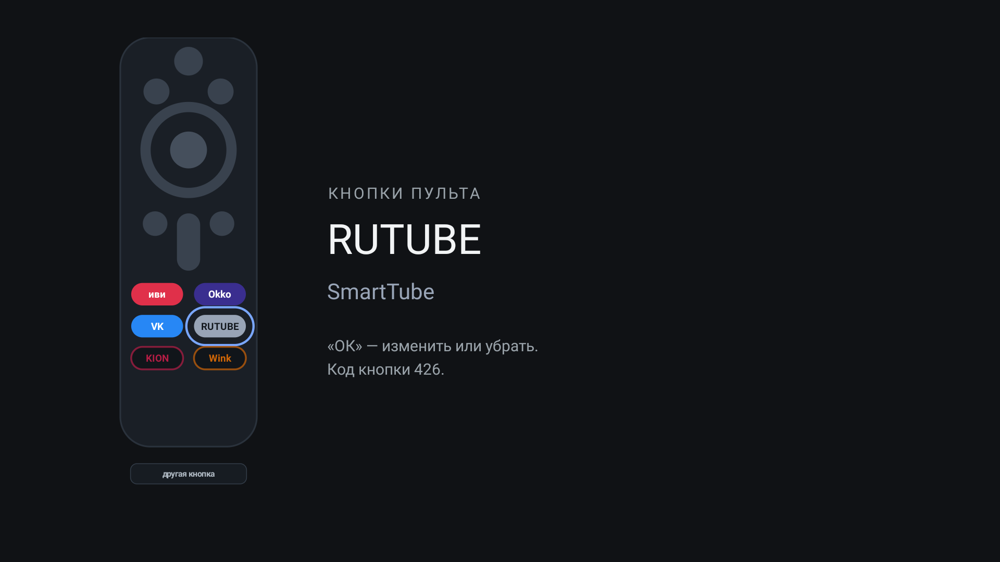

# Кнопки пульта

Переназначение фирменных кнопок пульта на Android TV: нажатие открывает выбранное приложение
или вход HDMI. Без рута, без разрешений, без зависимостей.

Сделано под Xiaomi TV с русским пультом, где шесть кнопок отданы иви, Okko, ВК Видео, RUTUBE,
KION и Wink — приложений этих на телевизоре может не быть, и кнопки просто уводят в Google Play.



## Установка

Скачать: **[keyhook.apk](https://github.com/jvckdubz/lme-keyhook/releases/latest/download/keyhook.apk)**

```sh
adb install -r keyhook.apk
adb shell "settings put secure enabled_accessibility_services ru.lme.keyhook/ru.lme.keyhook.KeyHookService; settings put secure accessibility_enabled 1"
```

Служба специальных возможностей нужна потому, что иначе увидеть нажатие, когда приложение не на
переднем плане, нечем: штатного «кнопка → приложение» в Android нет.

Дальше — «Кнопки пульта» на телевизоре, назначать пультом.

## Коды кнопок

| кнопка | скан-код |
|---|---|
| иви | 433 |
| Okko | 152 |
| ВК Видео | 423 |
| RUTUBE | 426 |
| KION | 362 |
| Wink | 379 |

Вендор раскладывает их на игровые коды (`BUTTON_12`, `BUTTON_13` и рядом), по именам не найти.
На другом пульте коды другие — приложение узнаёт их само, пункт «другая кнопка».

Стрелки, «назад», «домой», громкость и питание не назначаются намеренно.

## Настройка из скрипта

```sh
# приложение
adb shell am broadcast -p ru.lme.keyhook -a ru.lme.keyhook.CONFIGURE \
  --ei scan 433 --es pkg top.rootu.lampa

# вход телевизора
adb shell am broadcast -p ru.lme.keyhook -a ru.lme.keyhook.CONFIGURE \
  --ei scan 423 --es pkg "input:com.mediatek.tvinput/.hdmi.HDMIInputService/HW5"

# убрать одну: --es pkg ""   |   убрать все: --ez clear true
```

Список входов: `adb shell dumpsys tv_input | grep inputId`.

## Что стоит знать

**После обновления приложения служба выключается** — включить той же командой.

**`am force-stop` противопоказан:** система считает это падением службы и больше её не
поднимает. Лечится выключением и включением:

```sh
adb shell "settings put secure enabled_accessibility_services ''; settings put secure accessibility_enabled 0"
adb shell "settings put secure enabled_accessibility_services ru.lme.keyhook/ru.lme.keyhook.KeyHookService; settings put secure accessibility_enabled 1"
```

Состояние: `adb shell dumpsys accessibility | grep -E 'Bound|Crashed'`.

**Лаунчер Google TV на своих плитках показывает по «ОК» контекстное меню**, пока включена любая
служба специальных возможностей. Не лечится со стороны приложения: проверено, что меню вылезает
и когда служба фильтрацию клавиш не запрашивает вовсе.

**Если кнопка всё равно уводит в Google Play** — её перехватывает
`com.xiaomi.android.tvsetup.partnercustomizer`. Отключать его не надо: с ним же уйдёт значок
выбора источника на главном экране. Приложение с включённой службой перехватывает раньше.

**Прямой ссылки на раздел специальных возможностей нет.** Сам раздел есть — Настройки →
Настройки устройства → Специальные возможности, — но `ACCESSIBILITY_SETTINGS` подхватывает
заглушка Google и печатает «действие не поддерживается», а `ACCESSIBILITY_DETAILS_SETTINGS` не
объявлен вовсе. Поэтому кнопка в приложении открывает общие настройки, а путь показан текстом.

## Сборка

```sh
ANDROID_HOME=~/Android/Sdk sh build.sh   # out/keyhook.apk
```

Gradle не нужен: `build.sh` вызывает aapt2, javac, d8, zipalign и apksigner. Без `key.jks`
рядом создаётся одноразовый ключ — обновление с другим ключом поверх прежней установки не
встанет.

## Лицензия

Берите и переделывайте как угодно, без гарантий.
